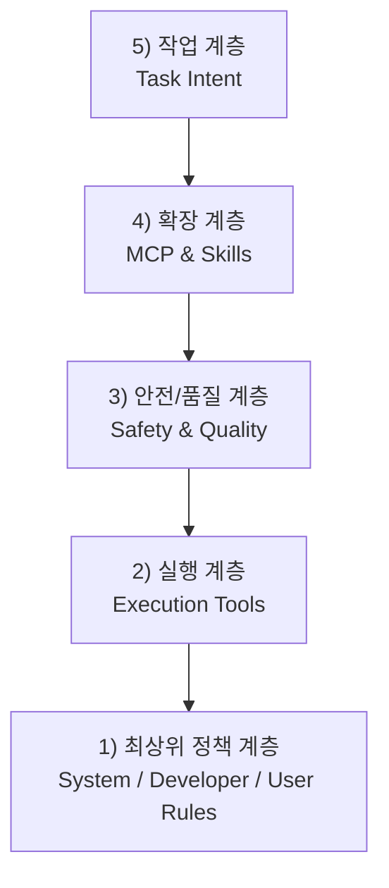

# Marketing AI Orchestration Harness

전략(M2) -> 실행(M3) -> 최적화(M4) -> 분석(M5) -> 보고(M6) 파이프라인을 단절 없이 운영하기 위한 프롬프트 레포입니다.

## 목적

- 캠페인/브랜드/카테고리/경쟁사 리서치 변수를 입력받아 마케팅 에이전트 팀을 통합 지휘
- 콘텐츠 전략, 콘텐츠 생성, 성과 분석, 보고를 단일 하네스로 연결
- ChatGPT, Claude, Gemini에서 공통 활용 가능한 프롬프트 체계 제공

## 폴더 구조

- `prompts/orchestration`: 오케스트레이션 마스터 프롬프트
- `prompts/stages`: M2~M6 단계별 전문 에이전트 프롬프트
- `prompts/specialized`: 이미지/메시지/영상 제안 등 확장 모듈
- `prompts/providers`: 모델별 적용 가이드(ChatGPT/Claude/Gemini)
- `schemas`: 단계 간 핸드오프 JSON 스키마
- `examples`: 입력 템플릿 및 실행 예시
- `scripts`: 변수 주입으로 최종 프롬프트를 렌더링하는 하네스

## 빠른 시작

1. 입력 변수 파일 작성
   - `examples/input-template.json` 복사 후 값 입력
2. 프롬프트 렌더링
   - `python3 scripts/render_prompt.py --input examples/input-template.json --stage orchestration`
3. 출력 프롬프트 사용
   - 생성된 `dist/` 파일을 ChatGPT/Claude/Gemini에 붙여 실행

## 지원 입력 변수

- `campaign_name`: 특정 기업 캠페인명
- `brand_name`: 특정 기업 브랜드명
- `brand_category`: 특정 기업 카테고리
- `competitor_set`: 유사 경쟁 기업 및 포지셔닝 정보
- `product_specs`: 제품/서비스 기술 및 증빙 정보
- `topic_clusters`: 콘텐츠 주제 클러스터
- `target_region`: 국가/언어/규제 민감도
- `campaign_data`: 성과 데이터(없으면 M5 시뮬레이션 모드)

## 권장 운영 방식

- 주간: M2/M3 재정렬 + M4 품질 게이트
- 월간: M5 증분 해석 + M6 경영진 1페이지 보고
- 분기: 경쟁사 리서치 갱신 + 메시지/크리에이티브 라이브러리 리빌드

## 전체 프롬프트 구조 도식화

### 트리 구조

```text
Marketing AI Orchestration Prompt System
├─ 1) 최상위 정책 계층 (Policy)
│  ├─ System 규칙
│  │  ├─ 역할/행동 원칙
│  │  ├─ 채널 규칙(commentary/final)
│  │  └─ 도구 우선 사용 원칙
│  ├─ Developer 규칙
│  │  ├─ 편집/검증/보고 방식
│  │  ├─ Git 안전 수칙
│  │  └─ 모드 전환(Agent/Plan) 기준
│  └─ User 규칙
│     └─ 항상 한국어 응답
├─ 2) 실행 계층 (Execution)
│  ├─ 파일/코드 탐색 도구(ReadFile, Glob, rg, SemanticSearch)
│  ├─ 실행 도구(Shell, Await)
│  ├─ 편집 도구(ApplyPatch, EditNotebook)
│  └─ 검증 도구(ReadLints, 테스트 커맨드)
├─ 3) 안전/품질 계층 (Safety & Quality)
│  ├─ 파괴적 명령 제한
│  ├─ 커밋/PR 절차 강제
│  ├─ 비밀정보 커밋 방지
│  └─ 변경 후 린트/검증 권장
├─ 4) 확장 계층 (MCP & Skills)
│  ├─ MCP 서버(브라우저, Notion, Supabase, Slack 등)
│  ├─ MCP 스키마 선확인 규칙
│  └─ 목적별 Skill 모듈(디버깅/배포/PR/문서화 등)
└─ 5) 작업 계층 (Task Intent)
   ├─ 사용자 목표 해석
   ├─ 단계별 실행(M2 → M6)
   └─ 결과 산출물(dist 프롬프트, JSON 출력, 보고물)
```

### 계층 다이어그램



### 해석 가이드

- `정책 계층`이 가장 강한 제약으로, 모든 실행 판단의 기준입니다.
- `실행 계층`은 실제 작업을 수행하는 도구 집합입니다.
- `안전/품질 계층`은 실행 중 실수와 리스크를 줄이는 방어선입니다.
- `확장 계층`은 외부 시스템 연동(MCP)과 재사용 가능한 작업 템플릿(Skill)을 담당합니다.
- `작업 계층`은 M2~M6 목표 달성을 위한 실제 사용자 요청과 산출물에 해당합니다.

### `prompts/` 파일별 계층 매핑

| 파일 경로 | 분류 | 매핑 계층 | 역할 요약 |
| --- | --- | --- | --- |
| `prompts/orchestration/master_orchestration_agent.md` | Orchestration | 5) 작업 계층 (Task Intent) | M2~M6 전체 파이프라인을 지휘하고 단계 간 입력/출력을 연결하는 최상위 실행 프롬프트 |
| `prompts/stages/M2_content_strategy_agent.md` | Stage (M2) | 5) 작업 계층 (Task Intent) | 리서치 변수 기반 콘텐츠 전략/프레임 설계 |
| `prompts/stages/M3_content_execution_agent.md` | Stage (M3) | 5) 작업 계층 (Task Intent) | 전략을 실제 콘텐츠 제작 지시/산출로 변환 |
| `prompts/stages/M4_optimization_agent.md` | Stage (M4) | 5) 작업 계층 (Task Intent) | 품질 게이트, 개선 루프, 실험/최적화 지시 |
| `prompts/stages/M5_performance_analysis_agent.md` | Stage (M5) | 5) 작업 계층 (Task Intent) | 성과 데이터 분석 및 인사이트 도출 |
| `prompts/stages/M6_executive_reporting_agent.md` | Stage (M6) | 5) 작업 계층 (Task Intent) | 의사결정자 관점의 보고/요약 산출 |
| `prompts/specialized/content_message_prompt.md` | Specialized Module | 4) 확장 계층 (MCP & Skills) | 메시지/카피라이팅 등 특정 목적 작업을 보강하는 확장 모듈 |
| `prompts/specialized/image_generation_prompt.md` | Specialized Module | 4) 확장 계층 (MCP & Skills) | 이미지 생성 업무를 위한 목적형 확장 프롬프트 |
| `prompts/specialized/video_service_proposal_prompt.md` | Specialized Module | 4) 확장 계층 (MCP & Skills) | 영상/서비스 제안서 성격의 특화 산출물 생성 모듈 |
| `prompts/providers/chatgpt_adapter.md` | Provider Adapter | 4) 확장 계층 (MCP & Skills) | ChatGPT 환경에 맞는 적용 규칙/변환 가이드 |
| `prompts/providers/claude_adapter.md` | Provider Adapter | 4) 확장 계층 (MCP & Skills) | Claude 환경에 맞는 적용 규칙/변환 가이드 |
| `prompts/providers/gemini_adapter.md` | Provider Adapter | 4) 확장 계층 (MCP & Skills) | Gemini 환경에 맞는 적용 규칙/변환 가이드 |

> 참고: 현재 `prompts/` 디렉터리의 파일은 `작업 계층(5)`과 `확장 계층(4)`에 집중되어 있으며, `정책/실행/안전 계층(1~3)`은 주로 시스템/개발자 지침 및 런타임 도구 규칙에서 담당합니다.
